<div align="center">



<br/>

<a href="https://www.linkedin.com/in/suraj-mishra-a610b620a/"></a>
<a href="mailto:surajmishragemini@gmail.com"></a>
<a href="https://leetcode.com/u/surajmishragemini/"></a>
<a href="https://suraj-world.vercel.app"></a>

<br/>


</div>

---

<details>
<summary><b>&nbsp;whoami — text version</b></summary>
<br/>

```ts
const suraj: Engineer = {
  role:      "Software Engineer — Backend / Full-Stack",
  education: "M.S. Computer Science, Northeastern University",
  stack:     ["C++", "TypeScript", "Java", "Node.js", "React", "PostgreSQL", "AWS"],
  focus:     "clean API contracts, real-time data, boring reliability",
  currently: {
    building: "Threadwire — RAG pipeline over manufacturing data",
    grinding: "Neetcode 150 + system design mocks",
  },
  principle: "Make it correct, then make it fast, then measure to prove it.",
  openTo:    ["Backend", "Frontend", "Full-Stack", "Contract"],
} as const;
```

</details>

---

## Tech Arsenal

<details open>
<summary><b>&nbsp;Languages</b></summary>
<br/>


</details>

<details open>
<summary><b>&nbsp;Backend &amp; Frameworks</b></summary>
<br/>


</details>

<details open>
<summary><b>&nbsp;Frontend</b></summary>
<br/>


</details>

<details open>
<summary><b>&nbsp;Data &amp; Infrastructure</b></summary>
<br/>


</details>

<details>
<summary><b>&nbsp;Tooling</b></summary>
<br/>


</details>

---

## Featured Work

| Project | What it does | Stack | Signal |
|---|---|---|---|
| **Threadwire** | Manufacturing intelligence platform — RAG over technical docs with a queryable knowledge graph | `LangChain` `TypeScript` `Postgres/pgvector` `D3.js` | multi-tenant auth, JWT + OAuth 2.0 |
| **Roommate Peacekeeper** | Real-time chore and expense splitting, live-synced across clients | `React` `Supabase` `Postgres` | race conditions fixed via row-level locking |
| **[portfolio](https://github.com/sm5689/portfolio)** | Personal site, static-generated and edge-deployed | `Astro` `Vercel` | ships on push |
| **[cppCodes](https://github.com/sm5689/cppCodes)** | C++ algorithm and data-structure reference | `C++` | 8 forks |

---

## Metrics

<div align="center">


</div>

---

## Algorithms & DSA

<div align="center">


</div>

**Interview prep in public** — Blind 75 into Neetcode 150, with written pattern notes per problem.

<details>
<summary><b>&nbsp;Pattern coverage</b></summary>
<br/>

| Pattern | Status |
|---|---|
| Arrays &amp; Hashing | shipped |
| Two Pointers / Sliding Window | shipped |
| Binary Search (incl. on answer) | shipped |
| Trees &amp; BST traversal (iterative) | shipped |
| Graphs — BFS / DFS / Topological Sort | in progress |
| Dynamic Programming (memo then tabulation) | in progress |
| Heaps / Intervals | queued |
| Tries &amp; Union-Find | queued |

</details>

---

## Now

```
[####-------]  Neetcode 150
[#####------]  System design (DDIA + mocks)
[########---]  Threadwire v2
[###--------]  Rust
```

---

<div align="center">


<br/><br/>

**Let's build something.** Open to Backend, Frontend, and Full-Stack roles.

<a href="https://www.linkedin.com/in/suraj-mishra-a610b620a/"></a>
<a href="mailto:surajmishragemini@gmail.com"></a>

<sub><code>git commit -m "keep going"</code></sub>

</div>
